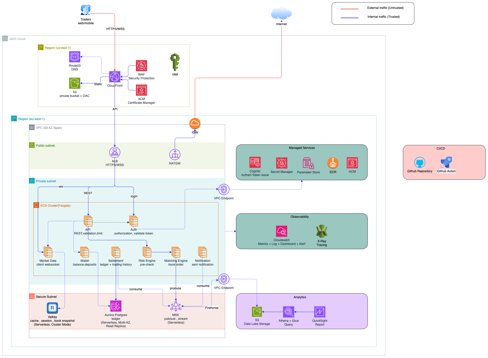

# Trading System Architecture Summary

## 1. Overview of the system

This platform is a cloud-native trading system designed for secure, low-latency, and highly available financial operations. The architecture separates the public internet-facing layer from the private execution layer so that customer traffic is filtered and controlled before it reaches the core trading services.

Targets: response time < 100ms, can handle 500 requests per second (RPS) with low latency. The system is designed to be resilient, with failover mechanisms and redundancy built into each layer.

## 2. Service and role in the system

| Service | Role in the system | Why it is used and alternatives considered |
|---|---|---|
| CloudFront | Global edge delivery and caching | Reduces latency for users around the world and offloads traffic from the origin services. It also helps absorb bursts in traffic during volatile market periods.CloudFront is preferred because it is managed, scalable, and integrates well with AWS security features. |
| WAF | Web application firewall | Protects the public endpoint from common web attacks, bot traffic, and abusive requests before they reach the app layer. Managed WAF is preferred because it is easier to operate and gives better protection with less operational burden. |
| ALB | Request routing and load distribution | Distributes traffic across multiple application instances and provides health checks, path-based routing, and resilience. It ensures the system remains available even if one instance fails. | NGINX/HAProxy on EC2, custom API gateway layer, or direct instance routing. A managed load balancer is preferred because it is highly available, built for cloud scale, and easier to operate. |
| PostgreSQL / Managed database | Transactional data persistence | Stores ledger data, wallet balances, order records, and account state with reliability and consistency. A managed relational database is preferred because trading systems need strong consistency and transactional guarantees. |
| Kafka / Event streaming | Decoupling and asynchronous processing | Enables order events, trade events, risk alerts, and notifications to move between services without tight coupling. This supports high throughput and helps handle bursts of market events. Other services such SQS or SNS can be used for similar purposes but less scalability and flexibility. |
| Redis Cache | Low-latency reads,session state,book snapshot | Speeds up frequent reads, supports in-memory lookups, and reduces demand on the primary database for hot data|
| ECS Fargate | Service orchestration and deployment | Serverless service enable running microservices in a portable and scalable environment, which is useful for independent deployment of trading components. **EC2 instances**, **EKS** are alternative but not cost-effective and increase operational complexity for this use case. |
| Observability stack (Metrics / Logs / Tracing / Alerting) | Monitoring and debugging | A trading platform must detect latency spikes, failed trades, or service issues quickly. Centralized observability supports production operations, incident response, and root-cause analysis. Local logs on instances or basic terminal logging only. A managed observability stack is preferred because it gives real-time insights across many services. Alternative solutions (**Prometheus, Grafana, ELK Stack, Datadog**) are available but require more setup and maintenance. |

## 3. Contraints and benefits
Almost componets are managed services and using serverless architecture, which reduces operational overhead and allows the team to focus on business logic rather than infrastructure management. The architecture is designed for high availability, low latency, and scalability to handle peak trading periods.

All components are designed to be horizontally scalable, span multi availability zones, and support disaster recovery (at least 02 AZs). The system is also designed with security in mind, using encryption, access controls, and monitoring to protect sensitive financial data.

With ECS Fargate: at least 02 tasks per service are deployed in each AZ, and the system can scale up to handle increased load during market volatility.

With infra components like CloudFront, WAF, and ALB, the system can handle sudden spikes in traffic without impacting the core trading services. Subnets and NatGW always span multiple AZs to ensure high availability and fault tolerance.

With serverless architecture, the system can scale down to zero when there is no trading activity, reducing costs during off-peak hours and deploy as cluster mode with autoscaling to handle peak trading periods. The system is designed to be resilient, with failover mechanisms and redundancy built into each layer.

Always apply security best practices, including encryption in transit and at rest, least privilege access controls, and regular security audits. The system is also designed to be compliant with relevant financial regulations and standards.

## 4. Scale plan

- ***Request 500/s***: system is in normal operation, with low latency and high availability.
- ***Request 5k/s***: system is in high load, review and increate max capacity for Redis shards, Kafka partitions, migrate from ECS Fargate to ECS EC2 or EKS if need to scale quickly (***Fargate have slow when scale***), and database read replicas. Monitor for any signs of latency or failed requests.
- ***Request 50k/s***: system is in critical load, migrate ALB to NLB for high throughput and low latency, consider to migrate Redis and MSK to provision mode for best performance, and review database scaling options (e.g., sharding, partitioning, or using a more scalable database solution). Implement rate limiting and backpressure mechanisms to protect the system from overload.