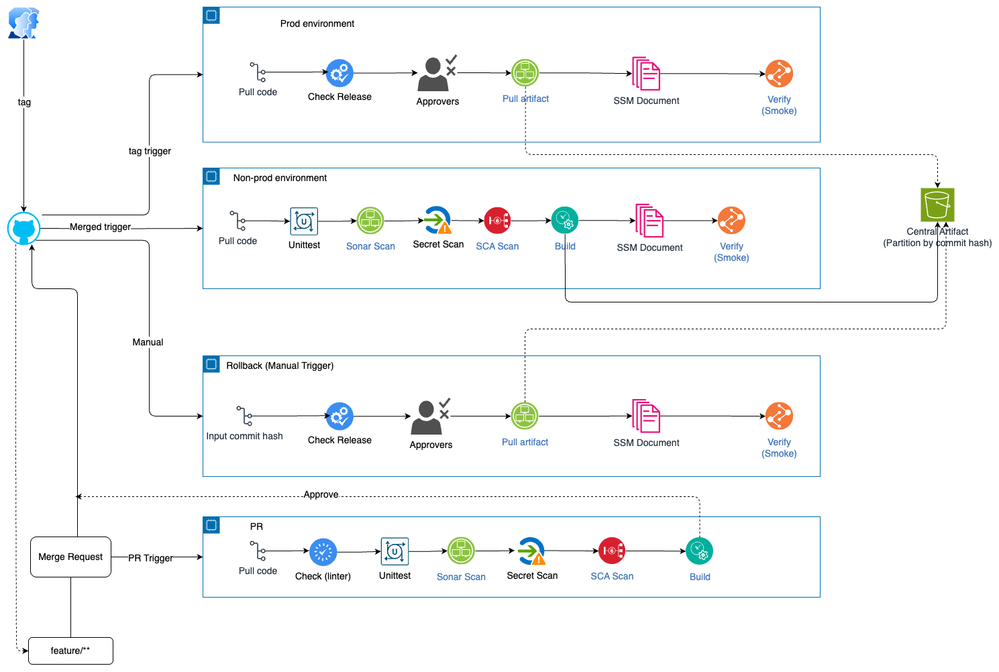
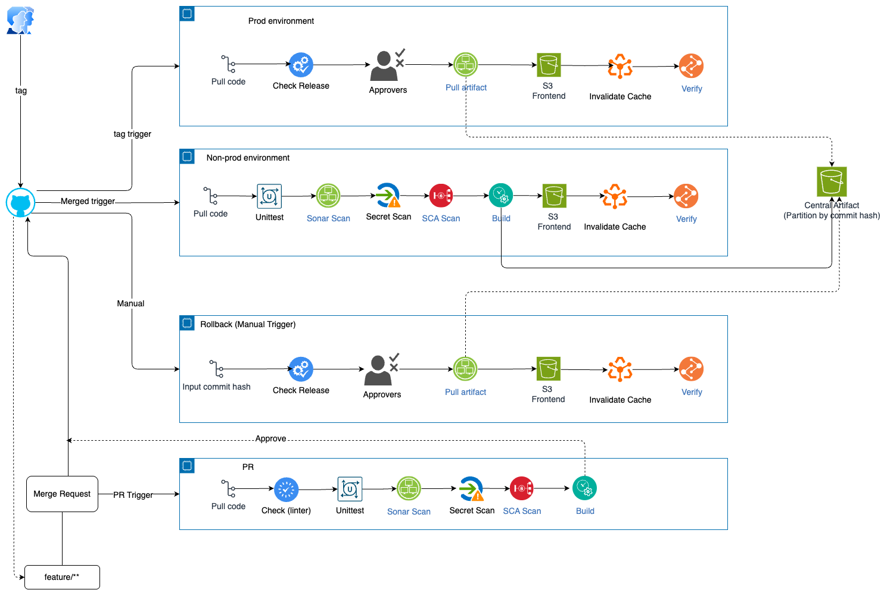

## Assumption:
1. Gitflow using is trunk-based, only merge to main branch to build/deploy
2. Code using for backend is Nodejs, frontend is Reactjs
3. Github already integrate with AWS IAM OIDC and have enough permission to deploy to AWS
4. EC2 for backend already register to System Manager, have SSM agent installed and running, and have enough permission to download artifact from S3 and deploy to application directory
5. Repo already setup approvers and restrict directly push to main branch, only allow merge PR with approvers
6. App flow : User --> CloudFront --> Backend API (EC2) / Frontend (S3 + CloudFront)

## Pipeline design:
Flows:
- PR created merge to main branch, trigger pipeline to run lint, unit test,SonarQube analysis, secret scan, SCA scan and test build, if any step failed, pipeline will stop and report to PR
- PR approved and merged to main branch, trigger pipeline to run lint --> unit test --> SonarQube analysis --> secret scan --> SCA scan --> build --> trigger auto deploy to non-prod environment, if any step failed, pipeline will stop and report to PR
- When all test passed and non-prod environment is stable, trigger manual approval to deploy to prod environment by tag on commit --> trigger deploy to prod with approvals, if any step failed, pipeline will stop and report to PR
- Rollback (manual trigger): trigger rollback to previous version by commit sha --> trigger rollback to prod with approvals, if any step failed, pipeline will stop and report to PR. Rollback can only run on main branch

1. Backend
Diagram:

    After build and push to central S3 artifact, Github Actions job will trigger a SSM Run Command to deploy the artifact to EC2 instances. The SSM Run Command will run a script on the EC2 instances to download the artifact from S3 and deploy it to the application directory. The script will also restart the application service to apply the new changes.

2. Frontend
Diagram:

## Implementation:
Reference to `workflows` folder in the repo, there are 2 workflows for backend and frontend, each workflow has 04 files:

- `*-pr.yml`: trigger on PR merge to main branch, run lint, unit test, SonarQube analysis, secret scan, SCA scan and build
- `*-nprd.yml`: trigger on PR merge to main branch, run lint, unit test, SonarQube analysis, secret scan, SCA scan, build and deploy to non-prod environment
- `*-prod.yml`: trigger on tag push to main branch, run deploy
- `*-rollback.yml`: trigger on manual workflow_dispatch, run rollback to previous version by commit sha

Additional files:
- `*.sh`: script to deploy/rollback the artifact on EC2 instances, run by SSM Run Command
- `config/*/*.json`: config file for frontend, copy to S3 bucket
- `images/*`: diagram for pipeline design

## Production ready checklist:
- [x] All tests are passing
- [x] Code is reviewed and approved
- [x] Deployment to non-prod environment is successful and verified
- [x] Sign off documentation and release notes are completed
- [x] Rollback plan is documented
