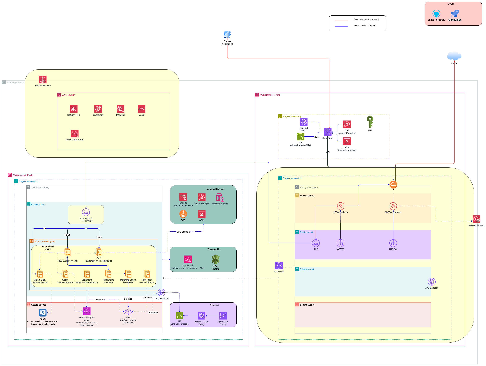

## Update Security for Trading System

***Note: Yellow boxes are the new security components added to the architecture.***

## Security components and their roles

| Service | Role in the system | Why it is used and trade offs |Trade offs|
|---|---|---|--|
| Shield Advanced | DDoS protection | Protects the system from volumetric and application layer DDoS attacks. It is a managed service that provides automatic mitigation and real-time attack visibility. | The trade-off is the **additional cost** associated with using Shield Advanced, but it is justified by the need for robust DDoS protection in a trading system. |
| GuardDuty | Threat detection and monitoring | Continuously monitors for malicious activity and unauthorized behavior. It uses machine learning and threat intelligence to identify potential threats ||
| Security Hub | Centralized security management | Aggregates findings from multiple AWS security services and provides a comprehensive view of the security posture. It helps in identifying and prioritizing security issues across the system. ||
| Inspector | Automated security assessment | Scans the system for vulnerabilities and deviations from best practices. It provides detailed reports and recommendations for remediation, it push findings to the Security Hub. ||
| Network Firewall | Network traffic filtering and control | Provides fine-grained control over inbound and outbound traffic at the network level. It allows for the creation of custom rules to block or allow specific traffic patterns, enhancing the security of the system. It enable inspect traffic at the network level for both ingress/egress with TLS inspection. | This will make a **high extra cost** and need additional resources for management. |
| Network Account | Centralized network management | Provides a centralized view and management of network resources across multiple accounts. It helps in enforcing consistent security policies and configurations, reducing the risk of misconfigurations and vulnerabilities, it help scale the platform easily in future growth. ||
| Istio Service Mesh | Secure service-to-service communication | Provides secure communication between microservices using mutual TLS, traffic encryption, and access control policies. It helps in preventing unauthorized access and eavesdropping on service-to-service communication. | The trade-off is the **additional complexity** introduced by managing a service mesh, but it is justified by the need for secure communication in a trading system. |
